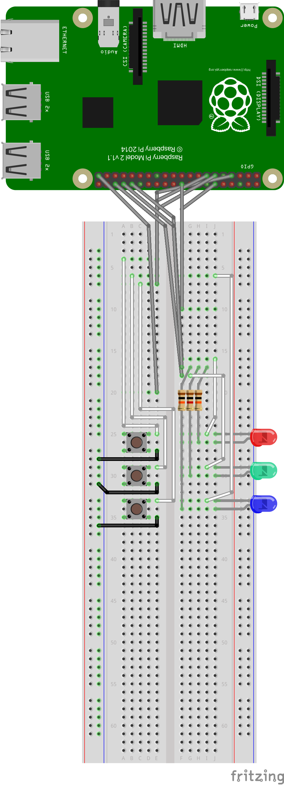

# Raspberry Pi - Simon Says game clone
Yet another Simon Says clone for Raspberry Pi, using Rust. I'm using a Raspberry Pi 2 B for this example, but it should work with any model.

# Circuit layout
This is the layout I'm using; the important part is to match the GPIO pins used for buttons & leds with the [constants at the top of the main file](./src/main.rs).



# Cross-compile and Deploy on a Raspberry Pi
Since Rust can easily cross-compile for other platforms, you don't have to worry about painfully slow compile times on a Raspberry Pi. Instead develop & build the game on a more powerful computer and then SCP & execute the game to the Pi.

I've tested this with both MacOS & Fedora hosts for development & coding, be sure to meet the pre-reqs for the platform you're using

## Pre-requisites
Instructions assume you have [Rustup](rustup.rs) installed already

### Fedora

```
$ sudo dnf install -y gcc-arm-linux-gnu
$ sudo dnf install -y binutils-arm-linux-gnu
$ rustup target add armv7-unknown-linux-musleabihf
```

### MacOS

```
$ brew install arm-linux-gnueabihf-binutils
$ rustup target add armv7-unknown-linux-musleabihf
```

## Cargo Config
You can provide the default target & linker in the `$project/.cargo/config` file (uncomment the appropriate `linker` spec based on your platform):

#### .cargo/config
```
[build]
target = "armv7-unknown-linux-musleabihf"
#
[target.armv7-unknown-linux-musleabihf]
linker = "arm-linux-gnu-gcc" # Fedora
# linker = "arm-linux-gnueabihf-ld" # MacOS
```


## Build & Deploy
You can use the `deploy.sh` script to build & deploy the game to a Raspberry Pi:

```sh
$ RPI_HOST=192.168.13.37 ./deploy.sh
   Compiling rpi-simon-says v0.1.0 (/home/thepacketgeek/code/rpi-simon-says)
    Finished release [optimized] target(s) in 1.65s
rpi-simon-says                                                100% 4136KB   2.0MB/s   00:02
Waiting for press... [0/5]
```